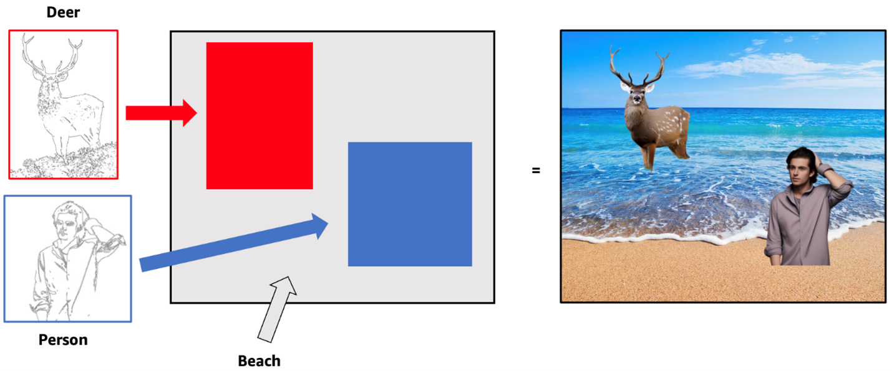

# Problem statement

Diffusion models [@sohl-dicksteinDeepUnsupervisedLearning2015] have realized excellent performance in generative computer vision tasks, ranging from human image generation [@kumarbhuniaPersonImageSynthesis2023] to optical illusion formation [@gengVisualAnagramsGenerating2024,@gengFactorizedDiffusionPerceptual2024], to multimodal generation [@chenImagesThatSound2024]. With the surging popularity of commercial applications such as DALL-E2 [@DALLE] and Midjourney [@Midjourney] diffusion models have been catapulted into the public eye. While diffusion models are capable of generating high-quality images and video, they can be difficult to control due to the stochastic nature of the sampling process and ambiguity in the prompts provided. In this work, we seek to realize increased control over generated image subcomponents by incorporating Canny Edge conditioning strategies from ControlNet [@zhangAddingConditionalControl2023a] into the MultiDiffusion [@bar-talMultiDiffusionFusingDiffusion2023] generation pipeline.

# Approach
Diffusion models are typically modeled as a combination of a forward and a reverse process (@fig-diffusion). While multiple formulations exist, we will primarily focus on Denoising Diffusion Probabilistic Models (DDPMs), one of the more popular variants of diffusion models [@croitoruDiffusionModelsVision2023]. Under the DDPM framework, the forward step consists of repeatedly adding Gaussian noise to an image across multiple time steps until the resulting image is indistinguishable from Gaussian noise. The reverse (generative) process attempts to estimate and remove the noise from the image at each time step using a neural network.

::: {#fig-diffusion}

Forward and reverse process of denoising diffusion probabilistic models [@croitoruDiffusionModelsVision2023]
:::

The MultiDiffusion pipeline unifies multiple segmentations into a single diffusion generation [@bar-talMultiDiffusionFusingDiffusion2023]. In @fig-multidiffusion, segmentation masks are provided for individual image components. In this example, the background mask is associated with the text prompt “blurred image”, while the two foreground masks are associated with “a mouse” and “a pile of books”, respectively. By training a new generation process on top of a pre-trained, frozen diffusion model, MultiDiffusion can generate visually consistent images provided the structure of these segmentation masks. 

::: {#fig-multidiffusion}
{width=33%}

MultiDiffusion image generation from segmentation masks[@bar-talMultiDiffusionFusingDiffusion2023]
:::

Conditional control architectures, such as ControlNet, on the other hand, can control diffusion models with various spatially localized input conditions, including Canny edges or human pose estimations, to produce highly specific output images that closely resemble one another, even when conditioned with additional text prompts [@zhangAddingConditionalControl2023a] (@fig-controlnet).   

::: {#fig-controlnet}

ControlNet image generation from Canny edge input[@zhangAddingConditionalControl2023a]
:::

We propose a pipeline that combines Canny edge conditioning from ControlNet with the multiple image segmentation masks approach of MultiDiffusion, to dynamically produce multiple highly controllable generations in a single visually coherent image @fig-pipeline.

::: {#fig-pipeline}

Proposed pipeline combining ControlNet control strategy with MultiDiffusion image generation
:::

# Plan for Experiments

The goal of our pipeline is to be able to fuse diffusion paths from two or more segmentation masks, each with their own Canny input. The resulting generations should appear visually consistent and reflect the original Canny edge inputs.

## Borrowed Code 

Both MultiDiffusion and ControlNet are designed to enhance the capabilities of pretrained Stable Diffusion models. In this work, we’ll experiment with a variety of baseline models but will likely use the [Stable Diffusion 2](https://huggingface.co/stabilityai/stable-diffusion-2) model from Stability AI due to its popularity. Additionally, as open-source implementations of both MultiDiffusion and ControlNet are available, we intend to leverage these in our solution. However, we will implement code combining these two approaches ourselves. 

## Data Collection 

Because we’re working with a pretrained model, significantly less data is required compared to training a model from scratch. However, we will still need to collect images to finetune our networks with, so we intend to use a tool such as Imageye [@ImageyeImageDownloader] to download large quantities of images from Google Images. Alternatively, we may also explore making use of existing image datasets such as the Common Objects in Context (COCO) dataset or one of the Large-scale Artificial Intelligence Open Network (LAION) datasets.

## Experiments

Our experiments will consist of multiple output generations using our proposed pipeline. In general, output images should be visually consistent and reflective of both the input Canny edges and segmentation masks. 

### Functionality Validation 

We will provide at least two Canny edge inputs to our pipeline to generate a single image. Our model is successful if: 
1. The output is controllable: For each distinct Canny edge input/segmentation mask, 90% of the input edges are accounted for by the Canny edge version of the corresponding region in the output image. Visual inspection should confirm that the output reflects the original Canny edge input. 
2. The output is visually consistent: Visual inspection should confirm the output appears as one cohesive image with similar visual theming, lighting, and color grading throughout, rather than multiple images from different sources being joined together.  

### Performance Comparison
We will test the results of our proposed pipeline against MultiDIffusion outputs without ControlNet features by comparing the visual consistency, time, and adherence to prompts. We aim to achieve improved performance compared to MultiDiffusion generations not enhanced with ControlNet Canny features.

### Stress Testing
To further understand the limitations of our proposed pipeline, we will attempt to find the lower limit on the size of the masks & the upper limit on the number of masks per image prior to breakdown of image quality caused by generations visually appearing significantly different from input Canny edges. 

### Influence of Dataset sizes 
As in Zheng et al (2023)[@zhangAddingConditionalControl2023a], we will explore the effect of decreasing training dataset size on the generation of recognizable images. We anticipate that our pipeline will achieve a similar breakdown point to the baseline ControlNet training.

<!-- ### Ambiguous Content Generation
We will test our ControlNet+MultiDiffusion pipeline on ambiguous input. Given the theoretical gains in both versatility and controllability of our model, we anticipate the generation of versitile, high-quality images from even minimal structure. -->